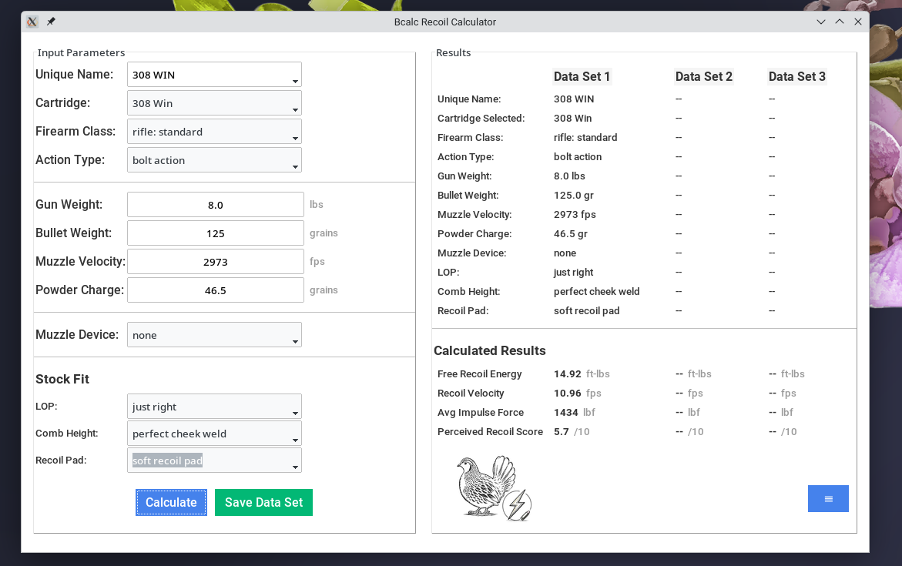
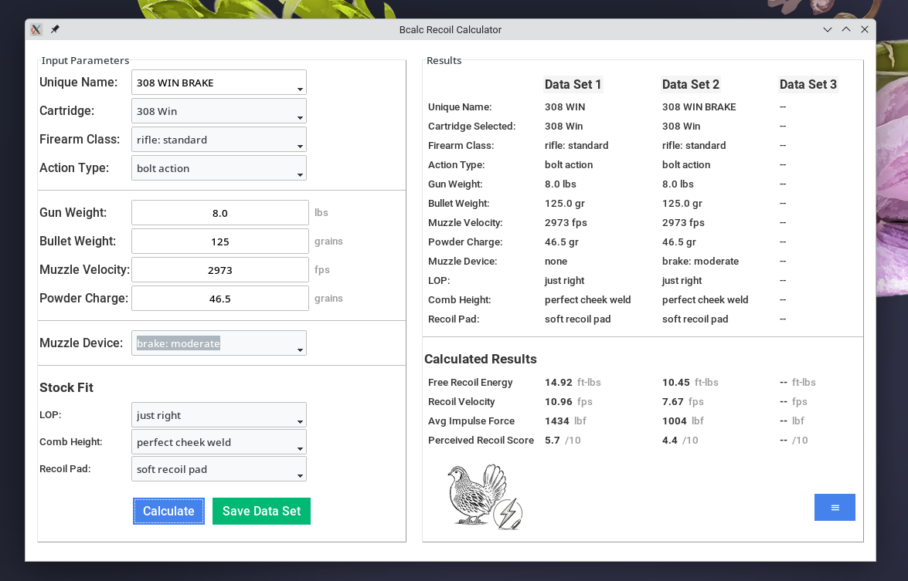
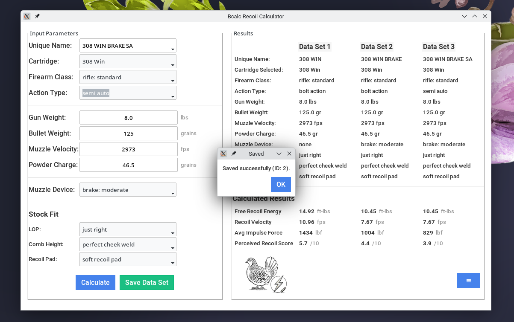

# Readme Contents

1. What is this?
2. Who is this for?
3. Installation Guide
4. User Guide
5. Credits & License

## 1. What is this?

The Bcalc Recoil Calculator is an open-source firearm recoil calculator.

You can enter specific firearm and ammo data and the calculator will estimate:

- free recoil energy: total energy absorbed
- recoil velocity: speed the firearm moves backwards
- average impulse force: average force on hands/ shoulder
- perceived recoil score: to be used in recoil comparisons

An internet connection is not required once installed. No user data is transmitted.

## 2. Who is this for?

Anyone interested in comparing recoil related calculations of different firearm and ammunition combinations.

## 3. Installation Guide

### 1. Linux (standalone application - no python installation required)

- download "bcalcrecoil" from the https://github.com/briancalc/bcalcrecoil/releases page
- open a terminal in the download folder and make the file executable using chmod +x bcalcrecoil
- to run using file manager, double click bcalcrecoil
- ro run from the terminal ./bcalcrecoil

### 2. Windows

- in progress

### 3. Mac

- in progress

## 4. User Guide

### Step 1.
Enter a unique name for the data set if you want to be able to refer to it later without having to enter all the variables again. Not required however.

### Step 2.
Select cartridge, firearm class, and action type from the drop-down menus.

### Step 3.
Enter gun weight (lbs), bullet weight (grains), and muzzle velocity.

### Step 4.
Enter a powder charge weight (grains) if known. The calculator will estimate if left blank.

### Step 5.
Select muzzle device, LOP, comb height, and recoil pad from the drop-down menus.

### Step 6.
Press the blue Calculate button to kick off the calculator. The results show up in the right panel.

### Step 7.
If you wish to compare a data set, change the input parameters, and press the Calculate button. In this example, a muzzle device was added.

### Step 8.
Press the green Save Data Set button if you wish to refer back to a specific firearm -- ammunition combination without having to reenter the data.

## 5. Credits & License

The Bcalc Firearm Management App was created by Brian Calc.

GNU General Public License (GPL) Version 3.
